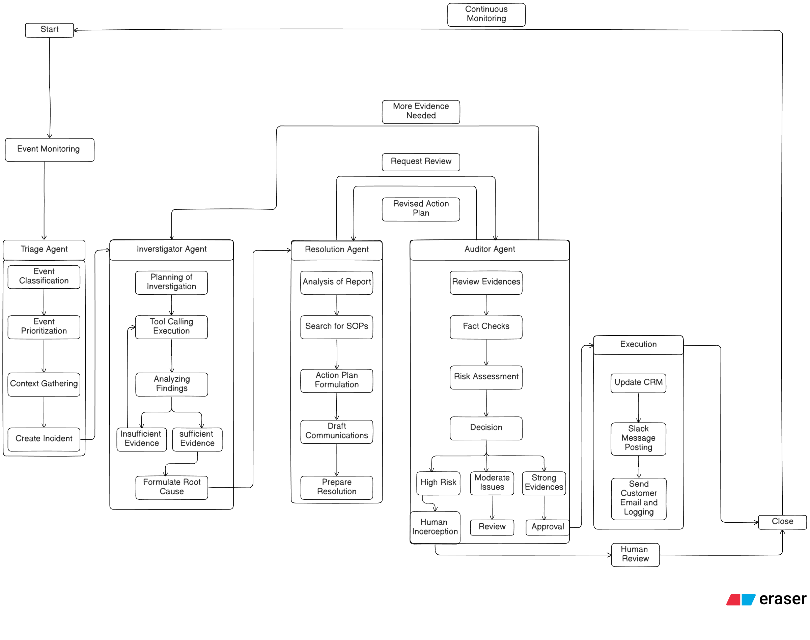
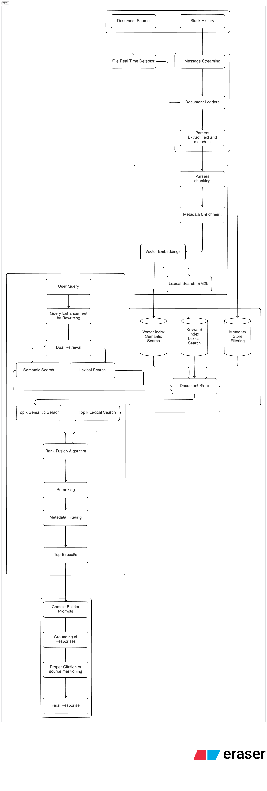
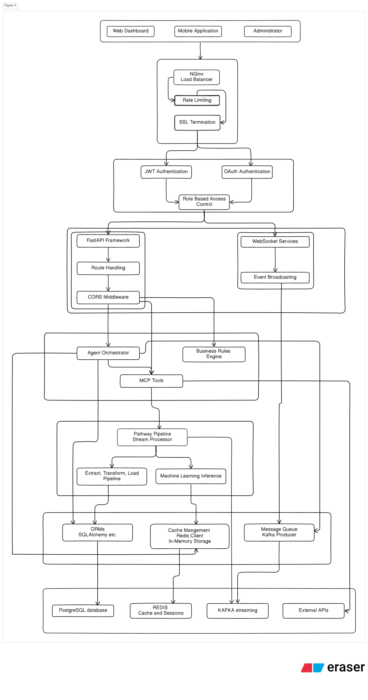
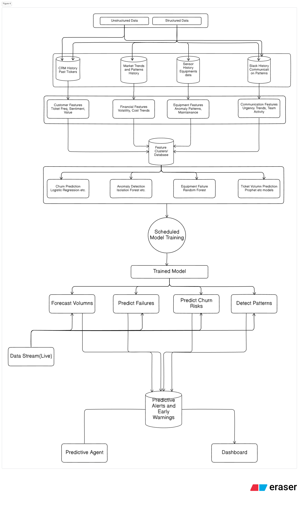

# Zenith Autonomous Operations Center – End-to-End Pipeline

This repository demonstrates the design of an Autonomous Operations Center, capable of ingesting live enterprise data, analyzing and triaging incidents, coordinating multi-agent resolution workflows, and surfacing insights in a real-time dashboard.

## High-Level Overview

The system is organized into four core phases:

1. Data Ingestion & Normalization (Raw Sensory Layer)

* IoT sensors, Finance APIs, Slack, CRM, and Knowledge Base docs.
* Ingested via Kafka (streaming), Airbyte connectors (CDC), and loaders (documents).

2. Data Processing & Storage (Cognitive Layer)

* Stream Processor: analytics + aggregation.
* Change Data Capture processors: real-time updates.
* Vector Store: hybrid RAG (retrieval augmented generation).
* Unified Database (Postgres + caching with Redis).

3. Agentic Layer

* Triage Agent: monitors input streams, classifies & prioritizes incidents.
* Investigator Agent: performs root-cause analysis with MCP tools.
* Resolution Agent: drafts and proposes response actions.
* Auditor Agent: validates and approves or requests revision.
* Predictive Agent: forecasts risks/incidents using analytics.

4. Perceptual Layer

* REST API Server + WebSockets → feeds into the frontend dashboard.
* Dashboard displays KPIs, incidents, workflows, and continuous monitoring.

---

## Architecture Design

### Complete Workflow.

The image can also be found [Here](https://github.com/vishesh-kumar-singh/Zenith-AOC/tree/main/Images/Pipeline.png)

### Orchestral Pipeline

The image can also be found [Here](https://github.com/vishesh-kumar-singh/Zenith-AOC/tree/main/Images/Orchestral_Pipeline.png)

### Data Retrieval

The image can also be found [Here](https://github.com/vishesh-kumar-singh/Zenith-AOC/tree/main/Images/Retrieval.png)

### API Structure with System Design

The image can also be found [Here](https://github.com/vishesh-kumar-singh/Zenith-AOC/tree/main/Images/API_Structure.png)

### Predictive Model

The image can also be found [Here](https://github.com/vishesh-kumar-singh/Zenith-AOC/tree/main/Images/Predictive_Model.png)

## Data Flow

Sources → Middleware → Database → MCP Server → Agents → Dashboard

### 1. Data Sources

* IoT sensors → Kafka broker.
* Finance APIs/news → Kafka broker.
* Slack & CRM events → Airbyte CDC connectors.
* Knowledge Base → Document Loaders.

### 2. Processing

* Stream Processor (analytics & aggregation).
* CDC processors (real-time updates).
* Vector Store for hybrid retrieval (BM25 + embeddings).

### 3. Storage

* Database(PostgreSQL for persistence)
* Redis for caching

### 4. Cognitive Layer

MCP server exposes: LiveAnalyticsTool, KnowledgeBaseTool, CRM Access Tool, Collaboration Tool, Predictive Tool, AuditLog Tool and external MCP tool

### 5. Agent Layer

Orchestration of Triage → Investigator → Resolution → Auditor (with feedback loops).
Predictive Agent plugged into monitoring loop.

### 6. Output

REST API server with WebSockets streams events.
Frontend Dashboard renders real-time insights.

## Key Components

### 1. Ingestion & Processing

* Kafka: high-throughput ingestion for IoT/finance streams.
* Airbyte: change-data-capture from SaaS (Slack, CRM).
* Document Loaders: indexing SharePoint/KB docs.

### 2. Storage

* PostgreSQL: structured data store
* Redis: caching layer for low-latency queries

### 3. Agents

* Triage Agent: filters, prioritizes, routes incidents.
* Investigator Agent: queries MCP tools, correlates data.
* Resolution Agent: proposes fixes, updates Slack/CRM.
* Auditor Agent: verifies correctness, approves/rejects.
* Predictive Agent: forecasts anomalies or churn.

### 4. Interface

* MCP Server: exposes tools for agents.
* REST + WebSockets: API gateway to dashboard.
* Dashboard: single pane of glass for operators.

## Database Schema Overview
The database is structured to manage the entire lifecycle of an incident, from raw data ingestion to predictive analysis and agent observability. It is divided into five main logical sections.

### 1. Data Sources / Raw Events
This section holds the raw, unprocessed data ingested from various external sources.

- machine_status: Records time-series data from IoT sensors, like temperature or pressure readings from a specific machine at a specific time.

- slack_messages: Stores messages from Slack, capturing the content, user, channel, and timestamp.

- crm_tickets: Contains details of customer support tickets, including their status, priority, and description.

- documents: Holds metadata for knowledge base articles and other documents.

- document_embeddings: Stores the vector representations of document chunks used for semantic search and Retrieval-Augmented Generation (RAG).

### 2. Analytics / Aggregates
This part of the schema stores processed data and the results of analytical computations.

- sensor_aggregates: Holds calculated metrics over time, such as rolling averages, standard deviations, and anomaly scores for sensor data.

- anomalies: A log of detected anomalies, detailing when an unusual event occurred, its severity, and a description.

### 3. Incident / Agent Workflow
This is the core operational section, tracking the state and progression of incidents as they are handled by the autonomous agents.

- incidents: The main table for tracking an issue from creation to resolution. It includes status, priority, and source.

- investigation_reports: Contains the findings of the Investigator agent, including its hypothesis about the root cause of an incident.

- evidence: Stores the specific data points and logs that support an investigation report.

- resolution_plans: Details the step-by-step actions proposed by the Resolution agent to fix an incident.

- audits: A log of all decisions made by the Auditor agent, such as approving or rejecting a proposed resolution plan.

### 4. Predictive Agent / Risk Forecasts
This section is dedicated to storing the outputs of the predictive models.

- predictive_forecasts: Contains future predictions, such as the forecasted failure time for a machine or a predicted spike in customer tickets.

### 5. Tool Call Logs (Observability)
This section is for system monitoring and debugging, providing a transparent view of the agents' activities.

- tool_calls: A detailed log of every tool used by an agent, recording what was requested, what was returned, and how long it took. This is crucial for observability.

---

## Tools & APIs

The MCP Server exposes a set of tools for agents to query live data, perform actions, and access knowledge. Each tool has a defined input/output structure and enforces authorization and rate-limits.

| Tool Name             | Purpose                                | Input Parameters                  | Output Format                                | Notes                                 |
|-----------------------|----------------------------------------|----------------------------------|---------------------------------------------|---------------------------------------|
| LiveAnalyticsTool     | Query live sensor & machine data       | `machine_id`                     | JSON: telemetry, aggregates, anomaly scores | Sub-second latency                     |
| KnowledgeBaseTool     | Retrieve knowledge base documents      | `query`, `k`                      | JSON: doc chunks + BM25 & embedding scores  | Hybrid BM25 + embeddings               |
| CRMTool               | Read/update customer tickets           | `ticket_id`, `updates`           | JSON: ticket status & history                | RBAC enforced                          |
| CollaborationTool     | Post messages/alerts to Slack channels | `channel`, `message`             | JSON: delivery status                        | Rate-limited; audit logged             |
| PredictiveTool        | Forecast machine anomalies or risks    | `machine_id`, `metric`           | JSON: predicted values + confidence         | Optional loop to agent workflow        |
| AuditLogTool          | Record agent actions and approvals    | `agent_id`, `action`             | JSON: timestamped logs                        | Immutable audit trail                   |

---