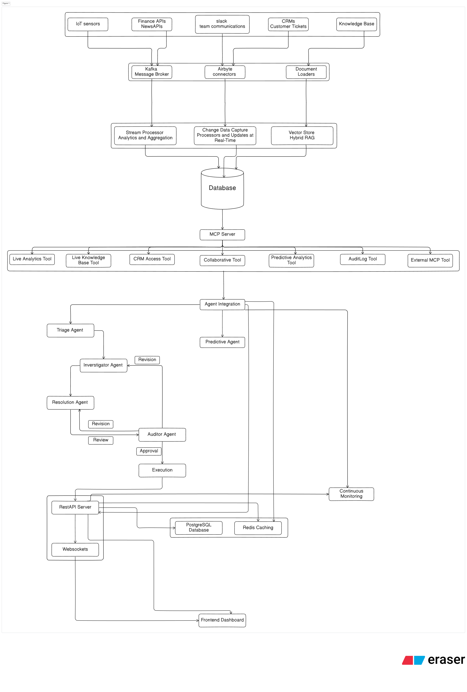

# Zenith Autonomous Operations Center – End-to-End Pipeline

This repository demonstrates the design of an Autonomous Operations Center, capable of ingesting live enterprise data, analyzing and triaging incidents, coordinating multi-agent resolution workflows, and surfacing insights in a real-time dashboard.

## High-Level Overview

The system is organized into four core phases:

1. Data Ingestion & Normalization (Raw Sensory Layer)

* IoT sensors, Finance APIs, Slack, CRM, and Knowledge Base docs.
* Ingested via Kafka (streaming), Airbyte connectors (CDC), and loaders (documents).

2. Data Processing & Storage (Cognitive Layer)

* Stream Processor: analytics + aggregation.
* Change Data Capture processors: real-time updates.
* Vector Store: hybrid RAG (retrieval augmented generation).
* Unified Database (Postgres + caching with Redis).

3. Agentic Layer

* Triage Agent: monitors input streams, classifies & prioritizes incidents.
* Investigator Agent: performs root-cause analysis with MCP tools.
* Resolution Agent: drafts and proposes response actions.
* Auditor Agent: validates and approves or requests revision.
* Predictive Agent: forecasts risks/incidents using analytics.

4. Perceptual Layer

* REST API Server + WebSockets → feeds into the frontend dashboard.
* Dashboard displays KPIs, incidents, workflows, and continuous monitoring.

---

## Architecture Diagram

The pipeline integrates data sources, middleware, agent orchestration, and dashboarding.

The image can also be found [Here](https://github.com/vishesh-kumar-singh/Zenith-AOC/tree/main/Images/Pipeline.png)

## Data Flow

Sources → Middleware → Database → MCP Server → Agents → Dashboard

### 1. Data Sources

* IoT sensors → Kafka broker.
* Finance APIs/news → Kafka broker.
* Slack & CRM events → Airbyte CDC connectors.
* Knowledge Base → Document Loaders.

### 2. Processing

* Stream Processor (analytics & aggregation).
* CDC processors (real-time updates).
* Vector Store for hybrid retrieval (BM25 + embeddings).

### 3. Storage

* Database(PostgreSQL for persistence)
* Redis for caching

### 4. Cognitive Layer

MCP server exposes: LiveAnalyticsTool, KnowledgeBaseTool, CRM Access Tool, Collaboration Tool, Predictive Tool, AuditLog Tool and external MCP tool

### 5. Agent Layer

Orchestration of Triage → Investigator → Resolution → Auditor (with feedback loops).
Predictive Agent plugged into monitoring loop.

### 6. Output

REST API server with WebSockets streams events.
Frontend Dashboard renders real-time insights.

## Key Components

### 1. Ingestion & Processing

* Kafka: high-throughput ingestion for IoT/finance streams.
* Airbyte: change-data-capture from SaaS (Slack, CRM).
* Document Loaders: indexing SharePoint/KB docs.

### 2. Storage

* PostgreSQL: structured data store
* Redis: caching layer for low-latency queries

### 3. Agents

* Triage Agent: filters, prioritizes, routes incidents.
* Investigator Agent: queries MCP tools, correlates data.
* Resolution Agent: proposes fixes, updates Slack/CRM.
* Auditor Agent: verifies correctness, approves/rejects.
* Predictive Agent: forecasts anomalies or churn.

### 4. Interface

* MCP Server: exposes tools for agents.
* REST + WebSockets: API gateway to dashboard.
* Dashboard: single pane of glass for operators.

## Database Schema

### 1. Data Sources / Raw Events

```sql
CREATE TABLE machine_status (
    machine_id VARCHAR(50) NOT NULL,
    timestamp TIMESTAMPTZ NOT NULL,
    metric_name VARCHAR(50) NOT NULL,
    metric_value DOUBLE PRECISION,
    region VARCHAR(50),
    PRIMARY KEY (machine_id, timestamp, metric_name)
);

CREATE TABLE slack_messages (
    message_id VARCHAR(50) PRIMARY KEY,
    channel VARCHAR(50),
    user_id VARCHAR(50),
    text TEXT,
    timestamp TIMESTAMPTZ,
    machine_id VARCHAR(50)
);

CREATE TABLE crm_tickets (
    ticket_id VARCHAR(50) PRIMARY KEY,
    customer_id VARCHAR(50),
    status VARCHAR(20),
    priority VARCHAR(10),
    created_at TIMESTAMPTZ,
    updated_at TIMESTAMPTZ,
    description TEXT
);

CREATE TABLE documents (
    doc_id VARCHAR(50) PRIMARY KEY,
    title TEXT,
    source VARCHAR(50),
    created_at TIMESTAMPTZ,
    updated_at TIMESTAMPTZ,
    raw_text TEXT
);

CREATE TABLE document_embeddings (
    doc_id VARCHAR(50) REFERENCES documents(doc_id),
    chunk_id SERIAL,
    embedding VECTOR(1536),
    bm25_index TEXT,
    PRIMARY KEY (doc_id, chunk_id)
);
```

### 2. Analytics / Aggregates

```sql
CREATE TABLE sensor_aggregates (
    machine_id VARCHAR(50),
    metric_name VARCHAR(50),
    window_start TIMESTAMPTZ,
    window_end TIMESTAMPTZ,
    rolling_avg DOUBLE PRECISION,
    rolling_std DOUBLE PRECISION,
    anomaly_score DOUBLE PRECISION,
    PRIMARY KEY (machine_id, metric_name, window_start)
);

CREATE TABLE anomalies (
    anomaly_id SERIAL PRIMARY KEY,
    machine_id VARCHAR(50),
    metric_name VARCHAR(50),
    timestamp TIMESTAMPTZ,
    value DOUBLE PRECISION,
    z_score DOUBLE PRECISION,
    severity VARCHAR(10),
    description TEXT
);
```

### 3. Incident / Agent Workflow

```sql
CREATE TABLE incidents (
    incident_id VARCHAR(50) PRIMARY KEY,
    source VARCHAR(50),
    machine_id VARCHAR(50),
    status VARCHAR(20),
    priority VARCHAR(5),
    created_at TIMESTAMPTZ,
    updated_at TIMESTAMPTZ
);

CREATE TABLE investigation_reports (
    report_id SERIAL PRIMARY KEY,
    incident_id VARCHAR(50) REFERENCES incidents(incident_id),
    investigator_id VARCHAR(50),
    hypothesis TEXT,
    confidence FLOAT,
    created_at TIMESTAMPTZ
);

CREATE TABLE evidence (
    evidence_id SERIAL PRIMARY KEY,
    report_id INT REFERENCES investigation_reports(report_id),
    source VARCHAR(50),
    type VARCHAR(50),
    details JSONB,
    timestamp TIMESTAMPTZ
);

CREATE TABLE resolution_plans (
    plan_id SERIAL PRIMARY KEY,
    incident_id VARCHAR(50) REFERENCES incidents(incident_id),
    resolution_steps JSONB,
    executed BOOLEAN DEFAULT FALSE,
    created_at TIMESTAMPTZ,
    executed_at TIMESTAMPTZ
);

CREATE TABLE audits (
    audit_id SERIAL PRIMARY KEY,
    incident_id VARCHAR(50) REFERENCES incidents(incident_id),
    auditor_id VARCHAR(50),
    action VARCHAR(20),
    comments TEXT,
    timestamp TIMESTAMPTZ
);
```

### 4. Predictive Agent / Risk Forecasts

```sql
CREATE TABLE predictive_forecasts (
    forecast_id SERIAL PRIMARY KEY,
    machine_id VARCHAR(50),
    metric_name VARCHAR(50),
    forecast_time TIMESTAMPTZ,
    predicted_value DOUBLE PRECISION,
    confidence DOUBLE PRECISION,
    created_at TIMESTAMPTZ
);
```

### 5. Tool Call Logs (Observability)

```sql
CREATE TABLE tool_calls (
    call_id SERIAL PRIMARY KEY,
    agent_id VARCHAR(50),
    tool_name VARCHAR(50),
    request JSONB,
    response JSONB,
    latency_ms INT,
    tokens_used INT,
    timestamp TIMESTAMPTZ
);
```

This schema covers raw ingestion, analytics, multi-agent workflows, predictive monitoring, and observability.

---

## Tools & APIs

The MCP Server exposes a set of tools for agents to query live data, perform actions, and access knowledge. Each tool has a defined input/output structure and enforces authorization and rate-limits.

| Tool Name             | Purpose                                | Input Parameters                  | Output Format                                | Notes                                 |
|-----------------------|----------------------------------------|----------------------------------|---------------------------------------------|---------------------------------------|
| LiveAnalyticsTool     | Query live sensor & machine data       | `machine_id`                     | JSON: telemetry, aggregates, anomaly scores | Sub-second latency                     |
| KnowledgeBaseTool     | Retrieve knowledge base documents      | `query`, `k`                      | JSON: doc chunks + BM25 & embedding scores  | Hybrid BM25 + embeddings               |
| CRMTool               | Read/update customer tickets           | `ticket_id`, `updates`           | JSON: ticket status & history                | RBAC enforced                          |
| CollaborationTool     | Post messages/alerts to Slack channels | `channel`, `message`             | JSON: delivery status                        | Rate-limited; audit logged             |
| PredictiveTool        | Forecast machine anomalies or risks    | `machine_id`, `metric`           | JSON: predicted values + confidence         | Optional loop to agent workflow        |
| AuditLogTool          | Record agent actions and approvals    | `agent_id`, `action`             | JSON: timestamped logs                        | Immutable audit trail                   |

---